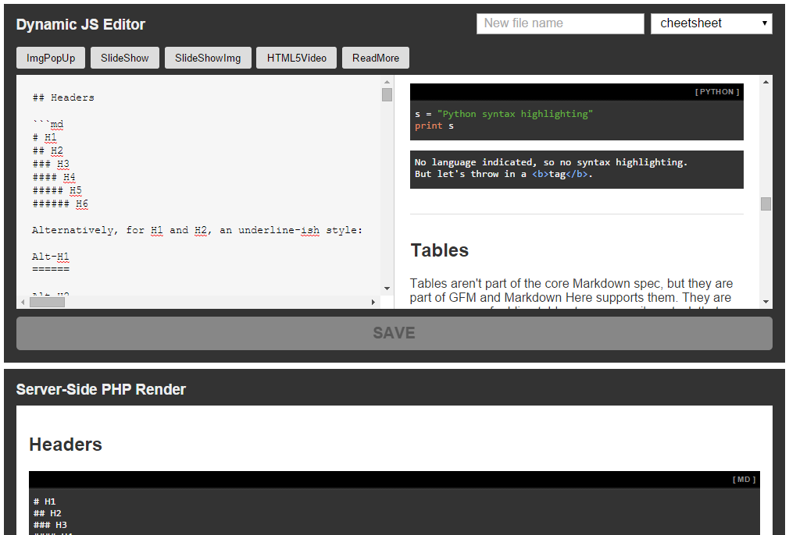

## Markdown Editor

I've been upgrading my custom CMS for my website and wanted to switch over to Markdown for post content. I'm running PHP for the backend so I have to basically duplicate my efforts when it comes to implementing the CMS.

PHP will handle the initial load instances (viewing a post), and JS will handle the live preview while creating the post in the CMS.

After some research I landed on [Parsedown](https://github.com/erusev/parsedown) for PHP, and [markdown-it](https://github.com/markdown-it/markdown-it) for JS. I originally tried [marked](https://github.com/chjj/marked), but Marked didn't allow for easy creation of custom markdown and that killed it for me.

Not to say that markdown-it was the silver bullet for my project. I had to write a [wrapper Class](js/CustomMarkdownIt.js) for it to allow me to more easily add my custom markdown (which they call plugins). I basically did the [same thing for Parsedown](php/CustomParsedownExtra.php), but it was far easier than anything I dealt with in JS.

---

## Features

* Browser will prompt user to save if they try to close the page/tab.
* You can enter in a new file name in the input next to the markdown file-select, save, and a copy of the current file will be created with the name provided. If a file exists with the same name, the files will be incremented so no data will be lost.
* The loading/changing of markdown files is URL based so you can load up editors in multiple tabs to edit whatever file you choose.
* Server-side & front-end parsing.
* Easier customization via wrapper Classes (mentioned above.
* Each custom plugin will have a button created in the GUI and insert it's 
custom markdown so there's not much needed for a user to implement it.